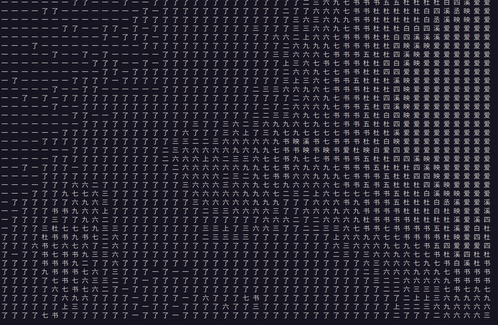

<h1 align="center">
Char Camera 字符摄像头
</h1>

<p align="center">
让摄像头输出在你的控制台！
</p>

用自定义的字符在控制台绘制酷酷的字符视频！



# Get Started

环境 `Ubuntu 22.04`

*用了 os.system("clear") ，不知道在非bash环境下是否能直接用*

(1) 安装 `opencv` 和 `numpy` 库

```shell
pip install -r ./requirements.txt
```

(2) 修改 `dic.txt` 设置使用的字符

比如 `dic.txt` 内容是：

```
一二三四五六七八九杜书丞爱上了白映溪
```

那么就会用这18个字作为基本元素组成字符画

*由于中英文字宽不一样，最好使用全英文/全中文字符*

(3) 修改 `sort.py` 文件中 `font_file` 变量的路径保持和控制台字体路径一致。该字体文件将用来评估字符打印后的像素密度

(4) 运行程序

```shell
python ./main.py
```
